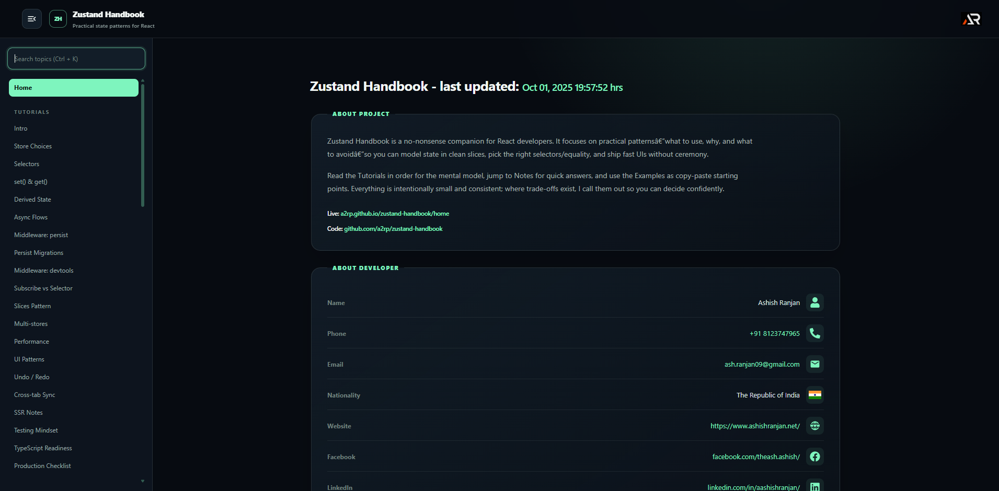

# Zustand Handbook

A practical React and Zustand handbook with focused tutorials, implementation notes, glossary entries, and runnable examples for everyday state-management decisions.



## Includes

- Tutorials for stores, selectors, async flows, middleware, persistence, testing, and performance
- Notes and a print-friendly API cheat sheet
- Runnable examples for counters, forms, async data, slices, undo and redo, and UI state
- Searchable sidebar navigation with route-based pages

## Run locally

```bash
npm install
npm run dev
```

## Build and deploy

```bash
npm run build
npm run deploy
```

Live: https://a2rp.github.io/zustand-handbook/home

## Links

Portfolio: https://www.ashishranjan.net/
GitHub: https://github.com/a2rp
CodePen: https://codepen.io/ash1198
LinkedIn: https://www.linkedin.com/in/aashishranjan
Facebook: https://www.facebook.com/theash.ashish/
YouTube: https://www.youtube.com/@ashishranjan-ashz?sub_confirmation=1
Email: mailto:ash.ranjan09@gmail.com

Support: https://a2rp-donation-page.netlify.app/
Buy Me a Coffee: https://buymeacoffee.com/a2rp
Patreon: https://www.patreon.com/a2rp
